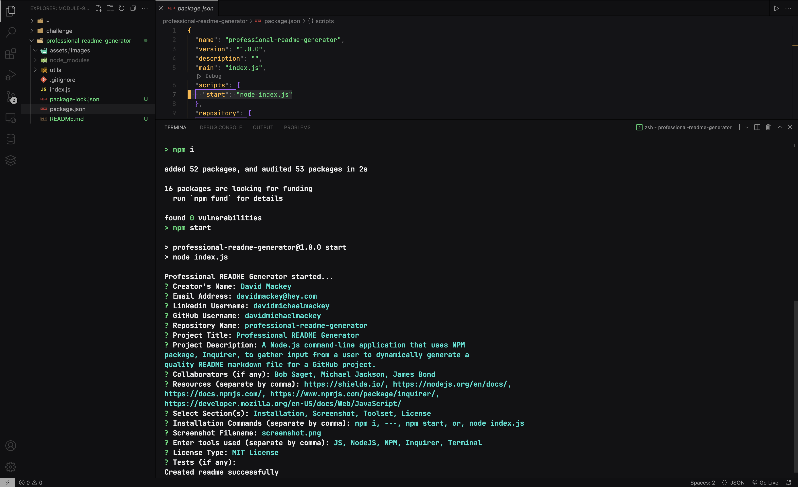

# { Professional README Generator }

## Badges

## Table of Contents

- [Description](#description)
- [Installation](#installation)
- [Usage](#usage)
- [Credits](#credits)
- [License](#license)
- [Contribute](#contribute)
- [Tests](#tests)
- [Questions](#questions)

## Description
A Node.js command-line application that uses NPM package, Inquirer, to gather input from a user to dynamically generate a quality README markdown file for a GitHub project.

## Installation
Follow these commands to run the command-line application:  

    npm i,---,npm start
    or
    node index.js

## Usage

  

    

## Credits

:bust_in_silhouette: [David Michael Mackey](https://www.notion.so/davidmichaelmackey/David-Mackey-a59ce61a996840d6a933e3b135673467?pvs=4) 
:email: [Email](mailto:davidmackey@hey.com) 
:octocat: [GitHub](https://github.com/davidmichaelmackey/) 
:briefcase: [Linkedin](https://linkedin.com/in/davidmichaelmackey/) 

### Resources

  [Shields.io](https://shields.io/)
  [JavaScript](https://developer.mozilla.org/en-US/docs/Web/JavaScript/)
  [NodeJS](https://nodejs.org/en/docs/)
  [NPM](https://docs.npmjs.com/)
  [Inquirer](https://www.npmjs.com/package/inquirer/)

## Toolset

    
    
    
    
    
      

## License

  

## Contribute

[Contributor Covenant](https://www.contributor-covenant.org/)

## Questions

Have Questions?
 
Feel free send me an [email](mailto:davidmackey@hey.com) or reach out to me on [Linkedin](https://linkedin.com/in/davidmichaelmackey/).

